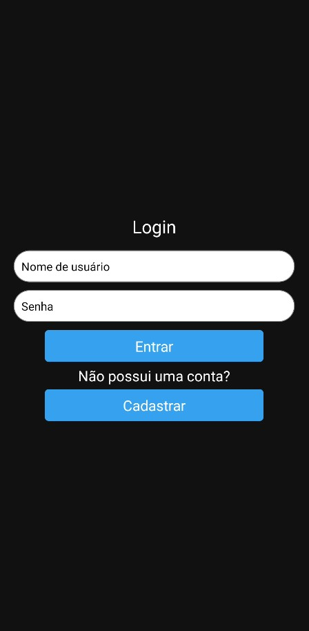
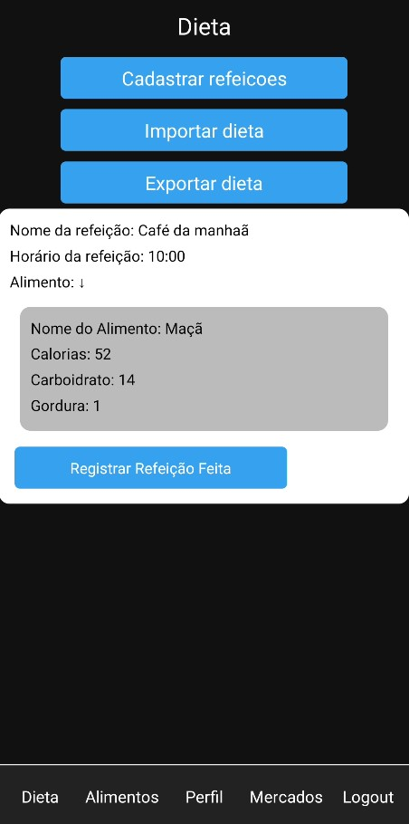
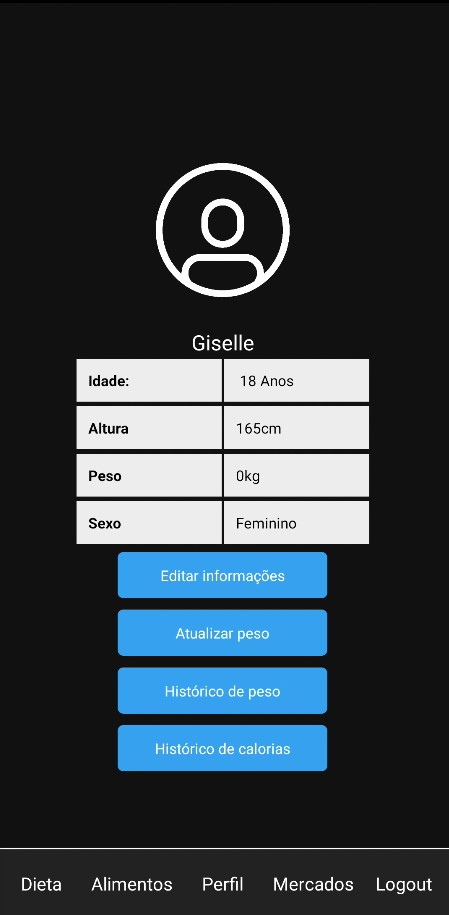
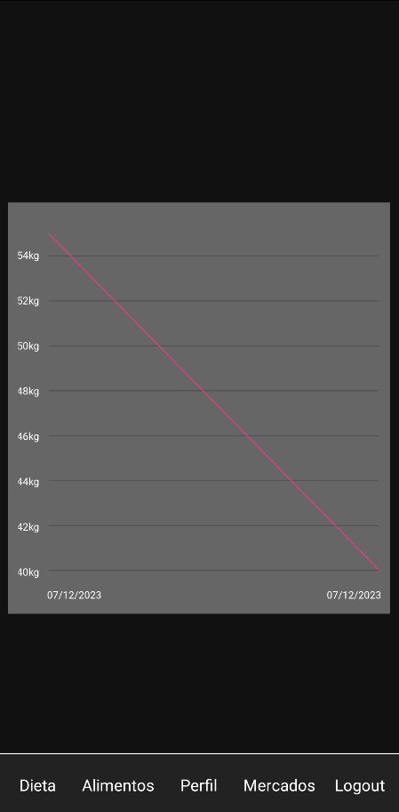

# Atividade Semestral da atividade de Programação para Dispositivos Móveis I

## Realizado e entregue em 13/12/2023

## Participantes:

| Nome | Github |
| :---: | :---: |
| Gabriel da Cunha de Macedo | [@Tuuca](https://github.com/Tuuca) |
| Ryan Alves de Quadros | [@XLryan246](https://github.com/XLryan246) |
| Lucas Vinicius da Silva Soares | [@LucasVinicius32](https://github.com/LucasVinicius32) |

## Descrição do projeto

O projeto consiste em um aplicativo de gerenciamento de dieta, onde o usuário pode cadastrar seus alimentos e suas refeições, e o aplicativo irá calcular a quantidade de calorias ingeridas pelo usuário.
Também há funcionalidades de cadastro e login de perfil, onde o usuário pode salvar seus dados e suas informações de dieta. Com o cadastro de peso e calorias ingeridas diariamente, o aplicativo mostra um gráfico de evolução de peso e calorias ingeridas.

## Tecnologias utilizadas

* React
* React Native
* JavaScript
* Firebase
* React Navigation
* Android SDK

## Imagens do aplicativo

| Tela de login | Dieta |
| :---: | :---: |
|  |  |
| Perfil | Gráfico de evolução |
|  |  |

## Como executar o projeto

### Pré-requisitos

* Node.js
* Android SDK
* React Native CLI

* Firebase
  + Criar um projeto no Firebase
  + Criar um banco de dados Firestore
  + Criar um arquivo .env na raiz do projeto com as seguintes variáveis de ambiente:
    - API_KEY
    - AUTH_DOMAIN
    - PROJECT_ID
    - STORAGE_BUCKET
    - MESSAGING_SENDER_ID
    - APP_ID
    - MEASUREMENT_ID

* Google Maps
   - Criar um projeto no Google Cloud Platform
   - Habilitar a API do Google Maps
   - Criar uma chave de API
   - Criar um arquivo .env na raiz do projeto com as seguintes variáveis de ambiente:
      - GOOGLE_MAPS_API_KEY

* Dispositivo Android ou emulador Android
   - Configurar emulador Android ou conectar dispositivo Android ao computador com depuração USB ativada

### Instalação

1. Clone o repositório
   

```sh
   git clone
   ```

2. Instale as dependências
   

```sh
   npm install
   ```

3. Inicie o aplicativo
   

```sh
   npx react-native run-android
   ```